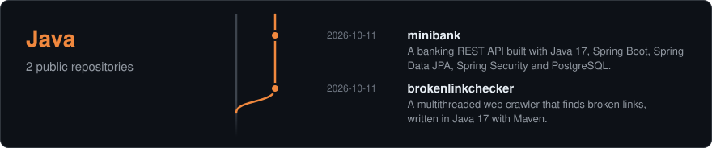
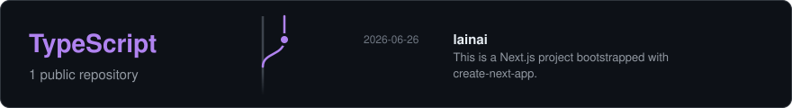

<picture>
  <source media="(max-width: 700px)" srcset="https://raw.githubusercontent.com/mvrhaa/mvrhaa/main/assets/graph-mobile.svg?v=afe2c05b8a">
  
</picture>

🔵 <b>Python</b> &nbsp;5 repositories

 

<picture>
  <source media="(max-width: 700px)" srcset="https://raw.githubusercontent.com/mvrhaa/mvrhaa/main/assets/branch-python-mobile.svg?v=fa47c85a82">
  
</picture>

  <a href="https://github.com/mvrhaa/phantasm"><code>phantasm</code></a>&nbsp;&nbsp;
  <a href="https://github.com/mvrhaa/curvelq"><code>curvelq</code></a>&nbsp;&nbsp;
  <a href="https://github.com/mvrhaa/log-watcher"><code>log-watcher</code></a>&nbsp;&nbsp;
  <a href="https://github.com/mvrhaa/web-crawler"><code>web-crawler</code></a>&nbsp;&nbsp;
  <a href="https://github.com/lod-qa/lodqa"><code>lod-qa/lodqa</code></a>

🟠 <b>Java</b> &nbsp;2 repositories

 

<picture>
  <source media="(max-width: 700px)" srcset="https://raw.githubusercontent.com/mvrhaa/mvrhaa/main/assets/branch-java-mobile.svg?v=0979d0ff38">
  
</picture>

  <a href="https://github.com/mvrhaa/minibank"><code>minibank</code></a>&nbsp;&nbsp;
  <a href="https://github.com/mvrhaa/brokenlinkchecker"><code>brokenlinkchecker</code></a>

🟣 <b>TypeScript</b> &nbsp;1 repository

 

<picture>
  <source media="(max-width: 700px)" srcset="https://raw.githubusercontent.com/mvrhaa/mvrhaa/main/assets/branch-typescript-mobile.svg?v=fd15cffbb0">
  
</picture>

  <a href="https://github.com/mvrhaa/lainai"><code>lainai</code></a>

I'm Ruslan, a second-year Computer Science student at the Polish-Japanese Academy of Information Technology (PJATK) in Warsaw. My focus is DevSecOps: security, DevOps and the cloud they run on.

I'm most interested in web security and computer networks. In my networking classes I write TCP and UDP programs in Java and use Wireshark to see what really goes over the wire. On the cloud side I work with AWS (IAM, security groups, VPC), package my projects with Docker and run them through GitHub Actions pipelines. I'm looking for a security or DevOps internship where I can learn from real cases and grow on the defensive side.

### Achievements

- **1st place, Quantum Optimization track, IBM Qiskit Fall Fest 2026.** I led a team of 5, built the QAOA solver and presented the demo to the jury.
- **AWS Academy Graduate, Cloud Foundations** (2026, 20 hours). [Verify on Credly](https://www.credly.com/go/WZQGixyS)
- **IBM SkillsBuild, Cybersecurity Fundamentals** (2026). [Verify on Credly](https://www.credly.com/badges/309205c8-b747-41ba-9841-b37fa36c0089)

### What I work with

- **Security:** OWASP Top 10, HTTP security headers, TLS certificates, password hashing and cryptography basics
- **Networking:** TCP/IP, UDP, DNS, HTTP and HTTPS, sockets, Wireshark, nmap
- **Cloud and DevOps:** AWS (IAM, security groups, VPC), Docker, GitHub Actions, Linux, Git
- **Languages:** Python, Java, SQL, Bash

I speak English (C1), Polish (B2), German (B1), Russian and Ukrainian (native).

  <code>~/links</code>&nbsp;&nbsp;
  <a href="https://www.linkedin.com/in/ruslan-murha-08309638a"><code>linkedin</code></a>&nbsp;&nbsp;
  <a href="https://t.me/mvrhaa"><code>telegram @mvrhaa</code></a>

